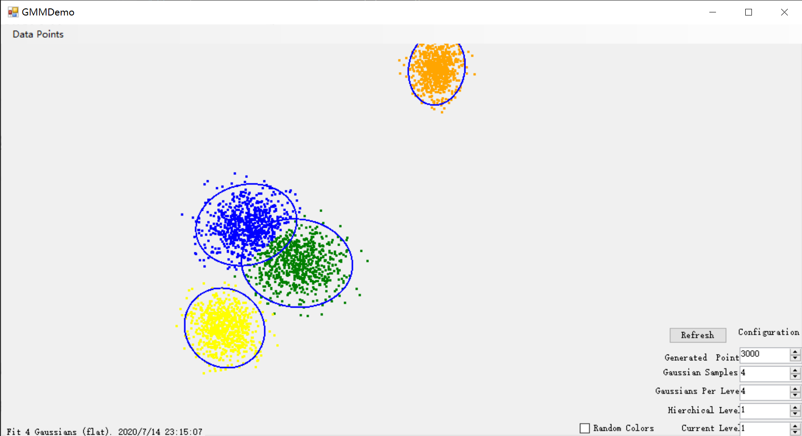
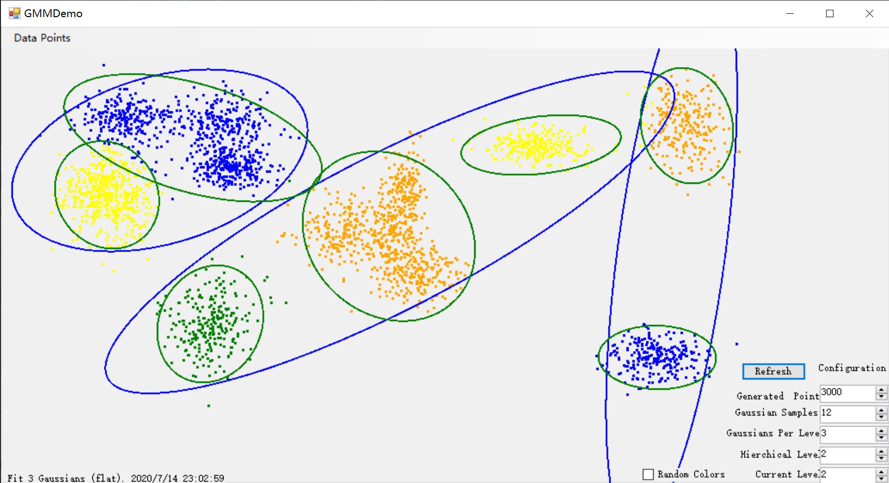

# GMM2D
This repo contains the 2D implementation of Hierarchical Gaussian Mixture Model (HGMM) (see [paper](https://www.cv-foundation.org/openaccess/content_cvpr_2016/html/Eckart_Accelerated_Generative_Models_CVPR_2016_paper.html))

## Requirement
Visual Studio 2019 Community and .net 4.7.2 

## DEMO Usage
Form menu navigation. 
image: Form screenshot

### Generate Random Data
What this button does
image: screenshot of the generated points

### So on....

## Implementation Details
We rigorously followed the implementation details in the [paper](https://www.cv-foundation.org/openaccess/content_cvpr_2016/html/Eckart_Accelerated_Generative_Models_CVPR_2016_paper.html) using hard partition and non-parallel construction. The development process is two-fold: we started with a flat, one level implementation, then we added a hierarchical architecture that recursively generates predictions as a multi-level gaussian tree.

### Flat GMM
GMM is a generative learning algorithm that predicts a mixture of Gaussians to approximate the ground truth distribution. No classification label is required as input, therefore it belongs to the unsupervised learning category.

Instead of using the matrix computation library - Math.NET, we defined new matrix datatypes and mathematical functions from the ground up. For the algorithm details, please refer to the [paper](https://www.cv-foundation.org/openaccess/content_cvpr_2016/html/Eckart_Accelerated_Generative_Models_CVPR_2016_paper.html) and [CS229 lecture notes](http://cs229.stanford.edu/notes/cs229-notes7b.pdf). 

### HGMM
To generalize flat GMM to a hierarchical structure, we partition the predicted Gaussians recursively based on the Maximum Likelihood estimates of subsurface expectation. The resulting hierarchical structure resembles an ordered full binary tree, but with arbitrary number of children for each node.

We simply encode the above tree structure in a large flat 1d array, which can be queried with simple indexing functions. Below is an HGMM prediction example, see **DEMO Usage** to understand what the different colors stand for.

### Functionalities
* Tikhonov regularization: Tikhonov regularization is done on the covariances to prevent numerical instability.
* Cluster drop: Dropping clusters with insufficient support (low class prior) to controls the degree of geometric complexity.
* Stopping condition: When maximum iteration is reached or the loglikelihood estimate stops changing.

### Future Improvements
* Use soft partition instead of hard partition as described in the paper, Section 3.4.
* Parallel construction: compute M-step in parallel with E-step, as described in Section 3.5.
