# GMM2D
This repo contains the 2D implementation of Hierarchical Gaussian Mixture Model (HGMM) (see [paper](https://www.cv-foundation.org/openaccess/content_cvpr_2016/html/Eckart_Accelerated_Generative_Models_CVPR_2016_paper.html))

## Requirements
Visual Studio 2019 Community and .net 4.7.2

## Implementation Details
We rigorously followed the implementation details in the [paper](https://www.cv-foundation.org/openaccess/content_cvpr_2016/html/Eckart_Accelerated_Generative_Models_CVPR_2016_paper.html) using hard partition and non-parallel construction. The development process is two-fold: we started with a flat, one level implementation, then we added a hierarchical architecture that recursively generates predictions as a multi-level gaussian tree.

### Flat GMM
GMM is a generative learning algorithm that predicts a mixture of Gaussians to approximate the ground truth distribution. No classification label is required as input, therefore it belongs to the unsupervised learning category.

Instead of using the matrix computation library - Math.NET, we defined new matrix datatypes and mathematical functions from the ground up. For the algorithm details, please refer to the [paper](https://www.cv-foundation.org/openaccess/content_cvpr_2016/html/Eckart_Accelerated_Generative_Models_CVPR_2016_paper.html) and [CS229 lecture notes](http://cs229.stanford.edu/notes/cs229-notes7b.pdf). 

### HGMM
To generalize flat GMM to a hierarchical structure, we partition the predicted Gaussians recursively based on the Maximum Likelihood estimates of subsurface expectation. The resulting hierarchical structure resembles an ordered full binary tree, but with arbitrary number of children for each node.

We simply encode the above tree structure in a large flat 1d array, which can be queried with simple indexing functions. Below is a 2 level HGMM tree with its predictions side-by-side, see **DEMO Usage** to understand what the different colors stand for.

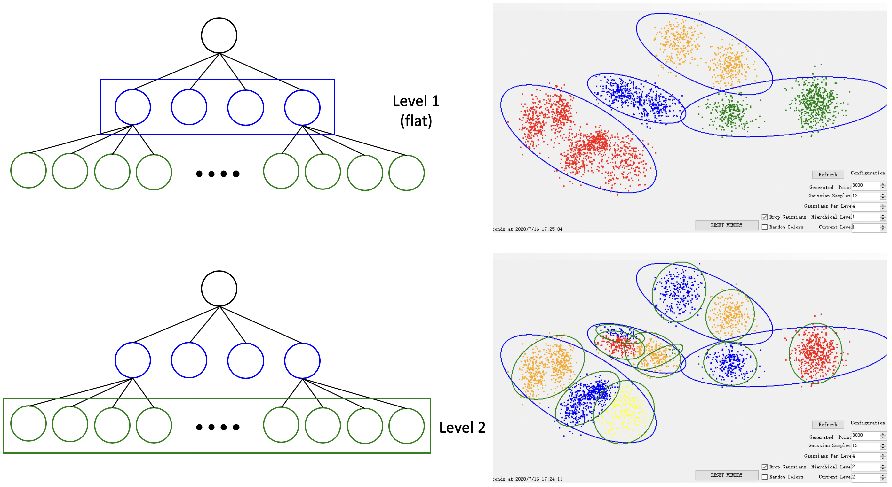

### Functionalities
* Tikhonov regularization: Tikhonov regularization is done on the covariances to prevent numerical instability.
* Cluster drop: Dropping clusters with insufficient support (low class prior) to controls the degree of geometric complexity.
* Stopping condition: When the maximum iteration is reached or the loglikelihood estimate stops changing.

### Future Improvements
* At each new level, initialize Gaussians at a smaller scale and only within the parent domain
* Use soft partition instead of hard partition as described in the paper, Section 3.4.
* Parallel construction: compute M-step in parallel with E-step, as described in Section 3.5.

## DEMO Usage
To better demonstrate the HGMM algorithm, we created a GUI for inputting parameters and visualizing the HGMM fit at each level of the hierarchy. Upon launch, a single page application will appear as seen below.      

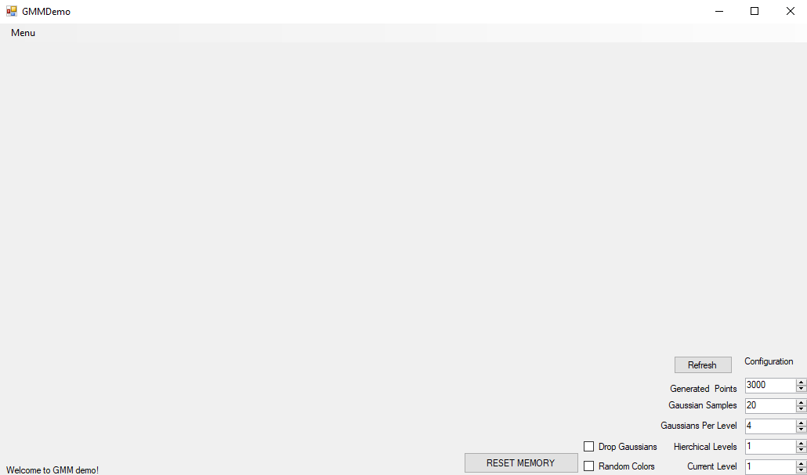

The application contains the following features which handle all operations for generating a HGMM.

### Status Label
The status label, located at the bottom left of the application, displays important information regarding HGMM algorithm execution and other processes the user initiates.

### Configuration Settings

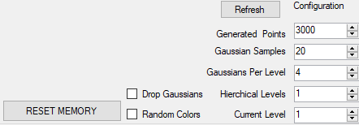

This section of the application handles all input settings for fitting a HGMM. While default values have been selected, it is advisable to input your own values. Please note while setting any numerical input value, either the up/down arrow must be used, or enter must be pressed after inputting a value.

* `Generated Points`: The number of points that will be generated in each batch of random uniform of gaussian points. Note that the total number of points in the dataset can be increased by generating multiple matches of points, with a varying number of points possible in each batch. 
* `Sample Gaussians`: Selects the number of Gaussian distributions in a flat GMM to sample generated points from if using the menu option `Gaussian Gaussian Data`. When generating multiple batches of gaussian data, this number can change as desired. 
* `Gaussians Per level`: Determines how many Gaussians are to be fit at each level of the HGMM. For large numbers of Gaussians, ensure both random and gaussian data is present for fit, as sparsity in the data may cause issues. Additionally, changing this parameter after a fit will require a new few to be ran before viewing other hierarchical layers.
* `Hierarchical Levels`: Selects how many levels in the HGMM will be fit. Changing this value will require a new fit to be generated to view other hierarchical layers. We recommend using at most three levels to avoid numerical instability. 
* `Current Level`: Selects which level the current points color labels correspond to when assigning each point to a gaussian in the HGMM. This value may be changed on the fly once a fit is generated.

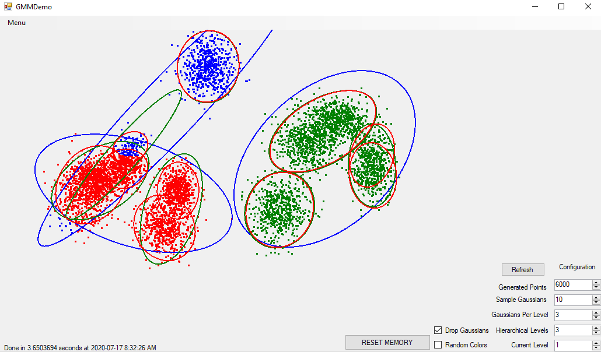 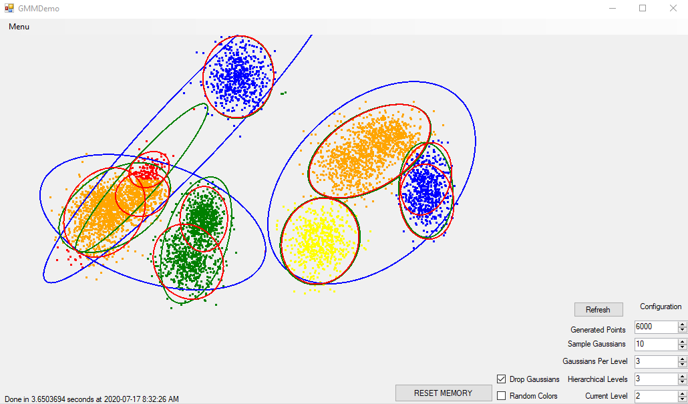 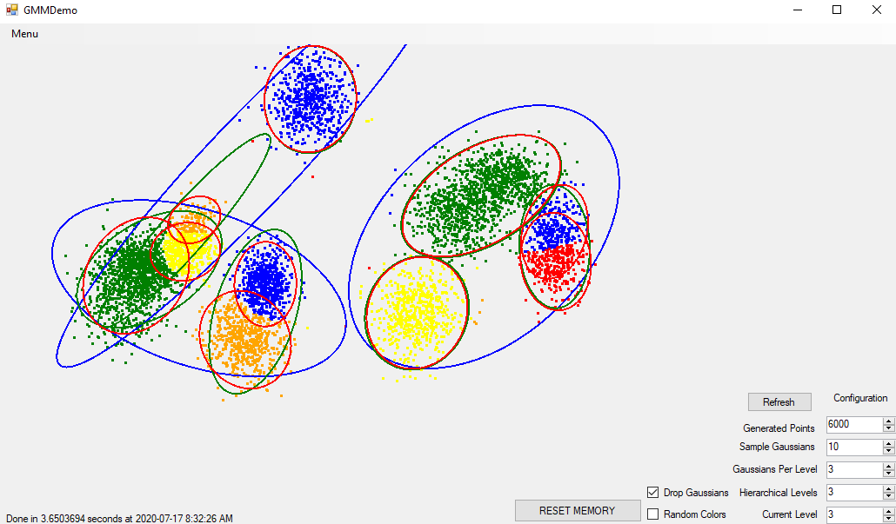

* `Drop Gaussians`: If selected, predicted Gaussians with a small class prior will be hidden in the visualization. However, their corresponding point color labels at a specific level will be shown.
* `Random Colors`: If selected, random colors will be shown for point color labelling. 
* `Refresh`: This button simply refreshes the canvas on which the visualization is drawn. It is typically used if the `Random Colors` checkbox is selected. 
* `RESET MEMORY`: Deletes all generated points and Gaussians from the application. Configuration settings will persist.

### Menu

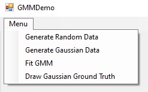

The menu contains options for creating random uniform data, random Gaussian data, showing the distributions from which this data was sampled, and running a HGMM fit. It contains the following options:
* `Generate Random Data`: Generates points across the screen according to a uniform distribution. The number of points is specified by the `Generated Points` configuration setting. This option can be pressed multiple times to generates multiple batches of points.

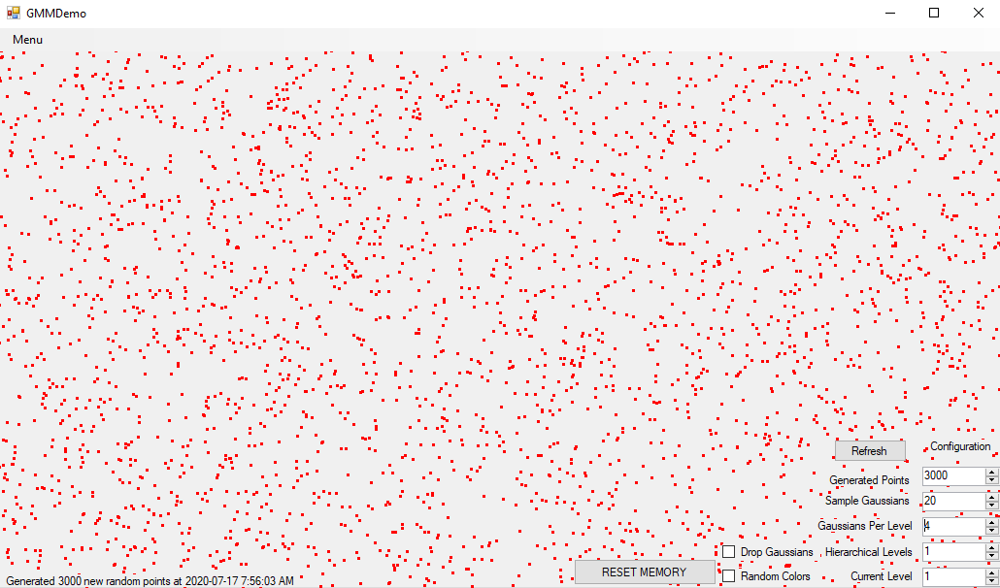

* `Generate Gaussian Data`: Generates points from multiple gaussian distributions. The mean vector and covariance matrix of these Gaussians are random within reasonable limits. The number of points generated is also specified by the `Generated Points` configuration setting, and the number of Gaussian distributions from which these points are generated is determined by the `Sample Gaussians` configuration setting. Multiple batches of points can be generated as well.

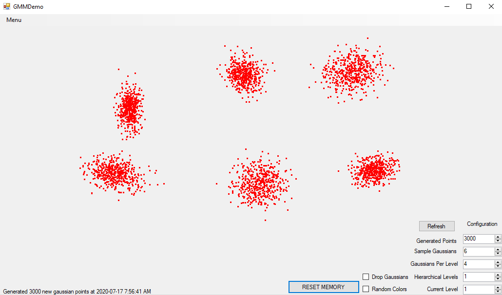

* `Fit HGMM`: Fits a HGMM to the displayed data points based on current configuration settings. If one hierarchical level is chosen, the implementation will effectively be a flat GMM. 

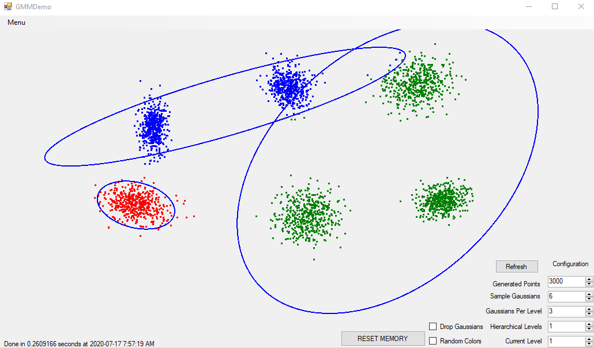

### Common Application Workflow
1. Input numerical configuration settings.
2. Generate one or more batches of points using either `Generate Random Data` or `Generate Gaussian Data`.
3. Select `Fit HGMM` to generate visualization. The status at the bottom left will indicate if an error has occurred, or completed calculation time.
4. (Optional) Compare fitted HGMM to ground truth of only gaussian random data if fitting a single level HGMM.
5. Change `Current Level` to see how points have been grouped at each level of the HGMM.
6. Select `Drop Gaussians` or `Random Colors` and `Refresh` to better see which gaussian points belong to.
6. Either generate more points and a new fit, or reset the visualization to start from scratch.

### Common Errors
* Subclusters tend to resemble the parent cluster (shown as the blue and green clusters below) and `Nan` error at deeper levels: This is because Gaussians are initialized with similar covariances and means at each level. It can be alleviated by initializing child clusters with smaller covariance and within the parent domain, which can be hard to implement. This behavior shows that the performance of GMM is highly dependant on how Gaussians are initialized, which is not a desired property.

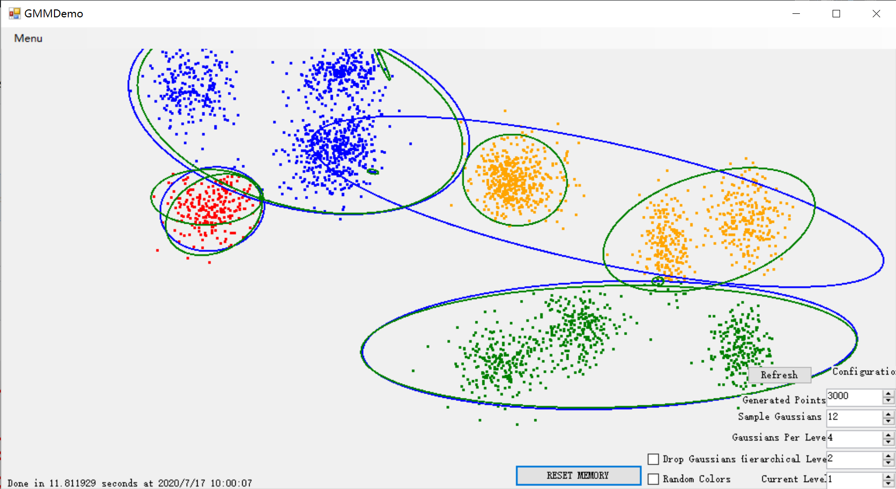

* Label status `Calculating...` and application frozen while trying to fit HGMM: Our implementation is not parallelized as described in the paper, and is single thread, single core. Neither did we use any of the efficiently designed matrix computation libraries. This can lead to long runtimes, exponentially so with more layers. Be considerate of your CPU!

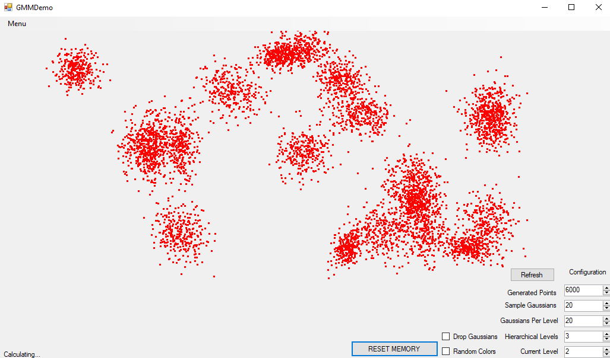

* Label status `One or more Gaussians failed to fit...`: Caused by a `NaN` error in HGMM algorithm due to too many Gaussians trying to be fit into sparse data. Consider generating more points or reducing either the number of levels or Gaussians per level. We recommend using at most three levels to avoid numerical instability. However, many valid Gaussians will be generated.

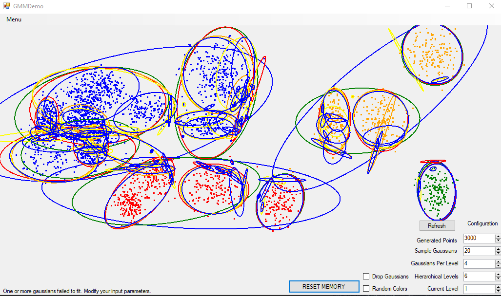

* Current Level out-of-bounds: If a level is selected that does not exist in the generated HGMM fit, all points will turn back to red. Simply select a valid level to fix this.

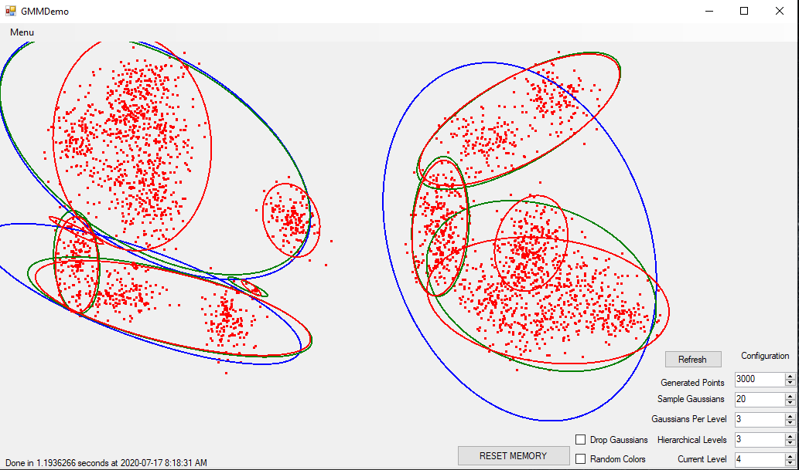

* HGMM fit-specific settings are changed before viewing levels: If this is done, it will invalidate the current fit, as indicated by ellipses turning blue and points turning red upon refresh. A new fit must be generated at this point.

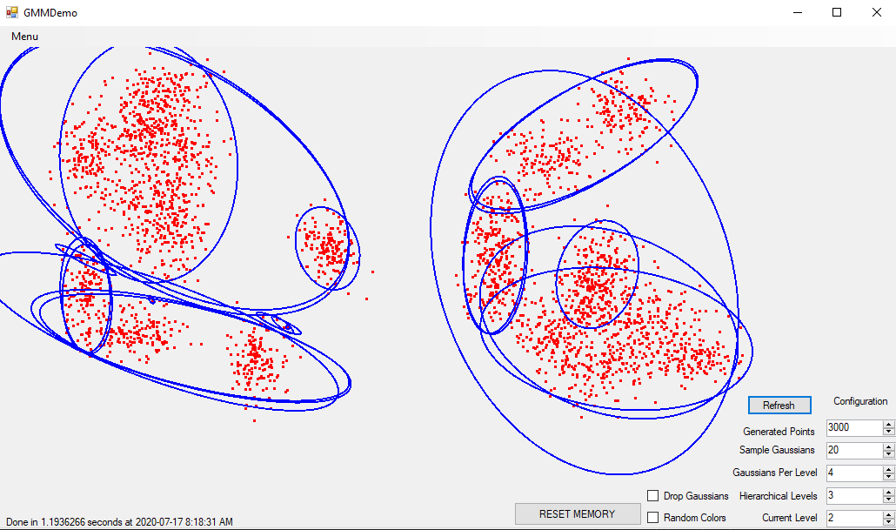
